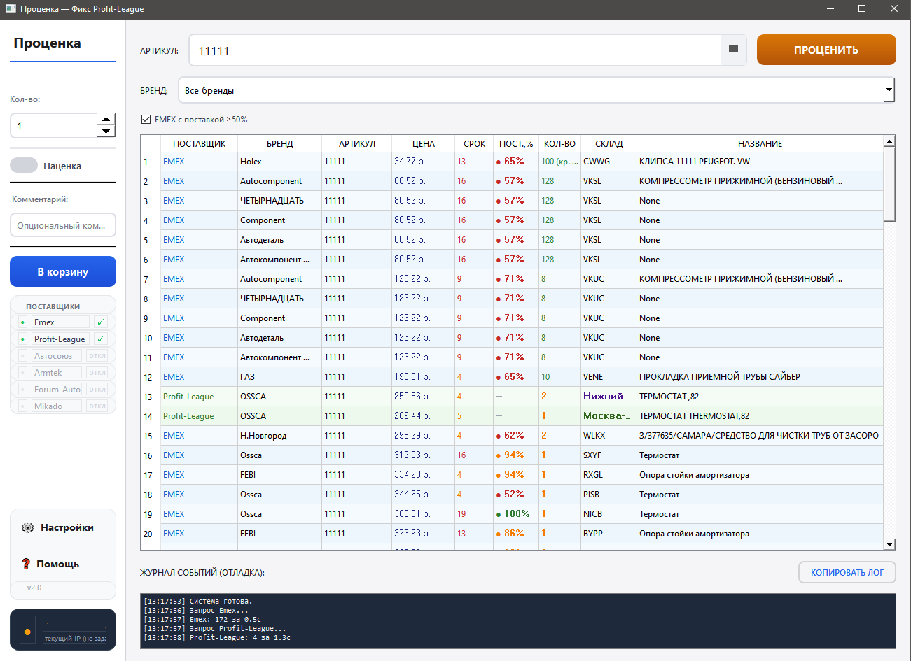

# 🔧 Проценка · price_parcer

**Бесплатный парсер цен автозапчастей** — одновременный поиск по 7 поставщикам, сравнение цен, корзина поставщика.

[]()
[]()
[]()
[]()
[]()
[]()

[📥 Скачать .exe](https://github.com/cyberanrhy/price_parcer/releases) · [🚀 Быстрый старт](#-быстрый-старт) · [📦 Поставщики](#-поддерживаемые-поставщики)

---



---

## 📌 О проекте

**Проценка** — это десктоп-приложение для поиска и сравнения цен на автозапчасти через API российских поставщиков. В одном окне вы видите цены, сроки доставки и кратность от Emex, Profit-League, Автосоюза, Armtek и других — и можете сразу отправить деталь в корзину поставщика.

Проект создан для пользователей **Skitchen PRO** и всех, кто профессионально занимается подбором автозапчастей.

---

## ✨ Возможности

- 🔍 **Параллельный поиск** — одновременный запрос ко всем подключённым поставщикам
- 📊 **Сравнение цен** — единая таблица с сортировкой по цене, сроку, поставщику
- 💰 **Наценка** — автоматический расчёт продажной цены
- 🛒 **Корзина поставщика** — добавление позиций напрямую в заказ
- 📜 **История поиска** — автодополнение при вводе
- 🚫 **Чёрный список брендов** — исключение ненужных производителей
- 📈 **Фильтр поставки Emex** — только позиции с поставкой ≥50%
- ⏱ **Тайминги запросов** — сколько времени ответил каждый поставщик
- 🌐 **Проверка IP** — контроль белого IP поставщика
- 🌙 **Тёмная тема** — автоматически подстраивается под систему

---

## 🏪 Поддерживаемые поставщики

| Поставщик | API | Поиск | Корзина |
|-----------|-----|:-----:|:-------:|
| Emex (ws.emex.ru) | SOAP (zeep) | ✅ | ✅ |
| Profit-League (pr-lg.ru) | REST | ✅ | ✅ |
| Автосоюз (avtoso-yz.ru) | REST | ✅ | ✅ |
| Armtek (armtek.su) | REST | ✅ | ✅ |
| Forum-Auto (forum-auto.ru) | REST | ✅ | ✅ |
| Mikado (mikado.su) | HTTP + XML | ✅ | ✅ |
| ABSTD (abstd.ru) | REST (md5) | ✅ | ✅ |

> ⚠️ Все поставщики требуют, чтобы ваш IP был внесён в белый список в их личном кабинете.

---

## 🚀 Быстрый старт

### Вариант 1: готовый exe

1. Скачайте [price_parcer.exe](https://github.com/cyberanrhy/price_parcer/releases/latest)
2. Запустите — откроется страница настроек
3. Заполните данные поставщиков, нажмите «Сохранить»
4. На главной странице введите артикул и нажмите Enter

### Вариант 2: из исходного кода

```bash
git clone https://github.com/cyberanrhy/price_parcer.git
cd price_parcer
pip install -r requirements.txt
python main.py
```

### Вариант 3: сборка exe самостоятельно

```bash
pip install auto-py-to-exe
auto-py-to-exe
```

Настройки: onefile, window-based (без консоли).

---

## ⚙️ Настройка поставщиков

При первом запуске откроется страница настроек. Для каждого поставщика нужно:

1. Включить его чекбоксом
2. Ввести учётные данные:
   - **Emex** — логин и пароль от ws.emex.ru
   - **Profit-League** — secret key из настроек API
   - **Автосоюз** — логин и пароль
   - **Armtek** — логин, пароль, VKORG, KUNNR_RG
   - **Forum-Auto**, **Mikado**, **ABSTD** — данные от ЛК
3. Нажать «Сохранить»

Данные хранятся локально:
- В режиме `.py`: `config/settings.json`
- В режиме `.exe`: `%APPDATA%\Проценка\settings.json`

---

## 🧱 Структура проекта

```text
price_parcer/
├── main.py              # GUI приложение (PyQt6)
├── settings_page.py     # Страница настроек
├── config_path.py       # Пути к конфигам
├── emex.py              # Провайдер Emex (SOAP)
├── pr_lg.py             # Провайдер Profit-League (REST)
├── avtosoyuz.py         # Провайдер Автосоюз (REST)
├── armtek.py            # Провайдер Armtek (REST)
├── forum_auto.py        # Провайдер Forum-Auto (REST)
├── mikado.py            # Провайдер Mikado (HTTP+XML)
├── abstd.py             # Провайдер ABSTD (REST)
├── screenshots/         # Скриншоты
├── config/              # Локальные настройки (в .gitignore)
├── requirements.txt     # Зависимости
└── *-api.md             # Документация API поставщиков
```

**Стек:** Python 3.10+ · PyQt6 · requests · zeep (SOAP) · concurrent.futures

---

## 🔐 Безопасность

- Все учётные данные хранятся **только на вашем компьютере**
- Исходный код **не содержит** тестовых или реальных ключей доступа
- Данные не передаются третьим лицам
- Программа подключается только к API поставщиков

---

## 📄 Лицензия

Распространяется под лицензией **MIT**. Можно использовать, изменять и распространять без ограничений.

---

*Сделано для сообщества авторазбора. ⭐ Если проект полезен — поставьте звезду.*
